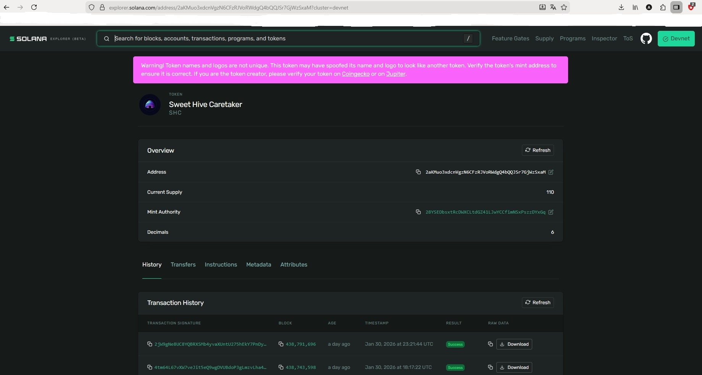
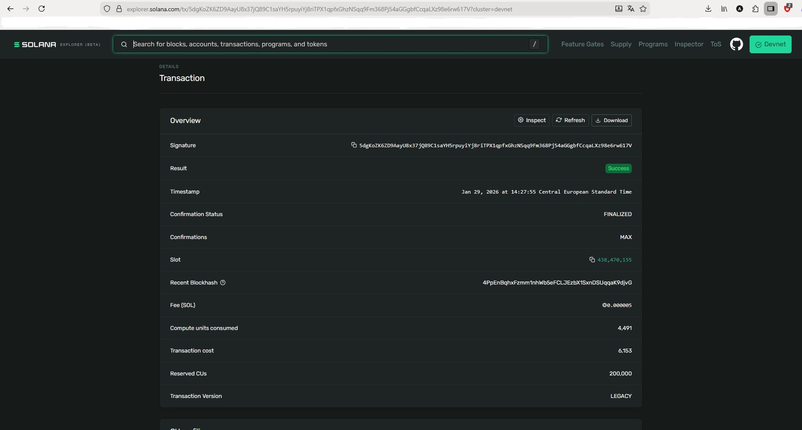

# Sweet Hive Caretaker (SHC) — SPL Token (Devnet)

## Objective
Create and initialize an SPL token on Solana devnet, including on-chain metadata,
mint tokens to the creator’s wallet, and transfer tokens to other wallets.

This project demonstrates:
- SPL token creation and initialization
- Token metadata creation
- Token minting
- Token transfers between wallets

---

## Token Information
- **Name:** Sweet Hive Caretaker  
- **Symbol:** SHC  
- **Network:** Devnet  
- **Mint Address:**  
  `2aKMuo3xdcnVgzN6CFzRJVoRWdgQ4bQQJSr7GjWzSxaM`

- **Token Page:**  
  https://explorer.solana.com/address/2aKMuo3xdcnVgzN6CFzRJVoRWdgQ4bQQJSr7GjWzSxaM?cluster=devnet

---

## Proof

### Token Page
Screenshot showing token name, symbol, logo, and mint address.



### Minting Transaction
The following transaction shows the initial minting of SHC tokens
to the creator’s associated token account (ATA).

- **Mint Tx (Signature):**  
  `5dgKoZK6ZD9AayU8x37jQ89C1saYH5rpuyiYj8riTPX1qpfxGhzNSqq9Fm368Pj54aGGgbfCcqaLXz98e6rw617V`

- **Explorer Link:**  
  https://explorer.solana.com/tx/5dgKoZK6ZD9AayU8x37jQ89C1saYH5rpuyiYj8riTPX1qpfxGhzNSqq9Fm368Pj54aGGgbfCcqaLXz98e6rw617V?cluster=devnet



---

## Token Transfers

SHC tokens were transferred from the creator’s associated token account
to other devnet wallets.

Example transfer transactions:
- https://explorer.solana.com/tx/5wf74LdQX84J7GfQYa2PGyoWRKYLF2XCQCrm73HdDsAhY4BDaZc2fHKqxEV23Btaoxo7E7zxUTFVYDSKXJK8KUR6?cluster=devnet
- https://explorer.solana.com/tx/5uTbSFy1tsxHyiMvcTZzqSudtXCmaj5KMqBk3kukZW4CNEmtJse7xkSjNRYxq17kaaHmFgg1kHATjXvfRNf1NWxt?cluster=devnet

---

## Files Used

- `week2/ts/cluster1/spl_init.ts`  
  Initializes the SPL mint and configures mint authority and decimals.

- `week2/ts/cluster1/spl_metadata.ts`  
  Creates on-chain token metadata using the Metaplex Token Metadata program
  and links off-chain JSON metadata (name, symbol, description, image).

- `week2/ts/cluster1/spl_mint.ts`  
  Mints SHC tokens to the creator’s associated token account (ATA),
  creating the ATA if it does not exist.

- `week2/ts/cluster1/spl_transfer.ts`  
  Transfers SHC tokens between wallets and automatically creates
  the recipient’s ATA when required.

---

## Implementation Notes

The starter files were provided with imports and basic scaffolding only.
All required logic was implemented as part of the assignment.

**`spl_init.ts`**  
Starter file contained imports and structure only. Implemented SPL mint initialization.

**`spl_metadata.ts`**  
Starter file contained imports only. Implemented on-chain token metadata creation.

At the start, signer configuration was:
  ```ts
  const signer = createSignerFromKeypair(umi, keypair);
  umi.use(signerIdentity(createSignerFromKeypair(umi, keypair)));
  ```
This was changed to:
  ```ts
  const signer = createSignerFromKeypair(umi, keypair);
  umi.use(signerIdentity(signer));
  ```
to reuse a single signer instance instead of creating multiple signer objects
for the same keypair.
Creating multiple signer instances for the same keypair results in different
objects that share the same public key, which may lead to unexpected errors.

The default devnet RPC endpoint ```https://api.devnet.solana.com)``` 
returned a *Forbidden error*, so an alternative RPC endpoint was used: 
```https://rpc.ankr.com/solana_devnet```

Additionally, 
```ts
.use(mplTokenMetadata())
``` 
was explicitly added to ensure stable interaction with the Metaplex Token Metadata program.
It registers the Token Metadata program ID in Umi, so Umi knows which on-chain
program to use when building metadata-related instructions.

**`spl_mint.ts`**
Starter file contained imports only. Implemented token minting logic.
The mint authority is always passed as a Signer (Keypair), not as a PublicKey,
since the authority must sign the transaction.

**`spl_transfer.ts`**
Starter file contained imports only. Implemented token transfers between ATAs.
The owner of the source token account is always passed as a Signer (Keypair),
as the transfer requires an explicit owner signature.

## General Notes
All transactions were executed on Solana devnet for testing.
