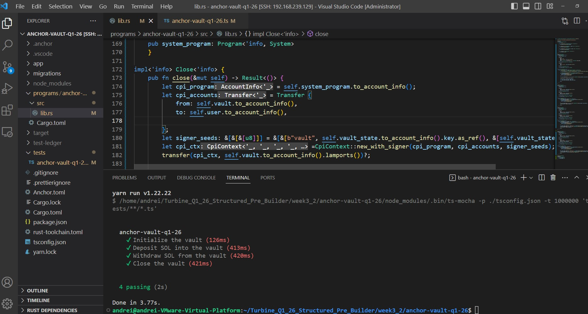

# Week 3.2 — Anchor Vault Program (Solana)

## Objective
Create a Vault Program using Anchor.

The goal of this task is to:
- initialize an Anchor program,
- implement instructions: `initialize`, `deposit`, `withdraw`, `close`,
- write tests for each instruction and ensure they pass.

---

## Overview

This project implements a simple **SOL vault** on Solana using **Anchor**.

The vault consists of:
- `vault_state` (PDA account) — stores bump seeds
- `vault` (PDA SystemAccount) — holds deposited SOL (lamports)

The program demonstrates:
- **Program Derived Addresses (PDAs)**
- **signer seeds** for authorizing transfers from a PDA-owned vault

---

## Instructions

### `initialize`
- Creates the `vault_state` PDA
- Derives the `vault` PDA
- Transfers the rent-exempt minimum to the vault
- Stores bump seeds in `vault_state`

### `deposit(amount)`
- Transfers lamports from the user to the vault PDA

### `withdraw(amount)`
- Transfers lamports from the vault PDA back to the user
- Uses PDA signer seeds to authorize the transfer

### `close`
- Transfers remaining lamports from the vault PDA to the user
- Closes the `vault_state` account and returns rent

---

## Project Structure

- Program source code:
anchor-vault-q1-26/programs/anchor-vault-q1-26/src/lib.rs

- Tests:
anchor-vault-q1-26/tests/anchor-vault-q1-26.ts

---

## Installation

To work with this project, the following toolchain is required:
- Rust
- Solana CLI
- Anchor CLI
- Node.js

A convenient way to install the Solana + Anchor toolchain is using the official installer:

```bash
curl --proto '=https' --tlsv1.2 -sSfL https://solana-install.solana.workers.dev | bash
```

A successful installation should produce output similar to:
```bash
Installed Versions:
Rust: rustc 1.91.1
Solana CLI: solana-cli 3.0.10
Anchor CLI: anchor-cli 0.32.1
Surfpool CLI: surfpool 0.12.0
Node.js: v24.10.0
Yarn: 1.22.1
```
Verify the installation by checking tool versions:
```bash
rustc --version && solana --version && anchor --version && surfpool --version \
&& node --version && yarn --version
```
Exact versions may vary.
This project was developed and tested with Anchor 0.32.x and a recent Solana CLI.

## How to Run

All commands are executed from the Anchor project directory:

```cd week3_2/anchor-vault-q1-26```

# Run tests

```bash
anchor test
```

This command:
- starts a local Solana test validator,
- builds and deploys the program,
- executes the full test suite.

In most cases, anchor test is sufficient, as it automatically
handles build and deployment.

Tests Result (Passing)


### Additional Notes — Debugging Setup

For development convenience, a VS Code debugging setup was used.

Added file:

``` .vscode/launch.json ```

# Debug workflow (ts)

Start a local validator in a separate terminal:

``` solana-test-validator --reset ```

Build and deploy the program:

``` anchor build ```
``` anchor deploy ```

Run the VS Code debug configuration to step through the test execution.

This debugging setup is optional and was used only during development.
The primary workflow for this assignment remains anchor test.

Rust program debugging

Debugging the on-chain program at the Rust level
(stepping through Anchor instructions) — TODO / planned for future improvement.

## Submission

This repository contains:

- Anchor vault program (initialize, deposit, withdraw, close)

- Tests covering all instructions

- Screenshot confirming all tests passing