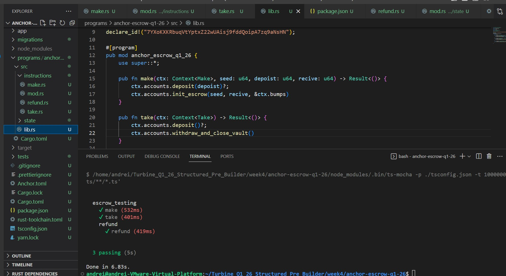

# Anchor Escrow Program (Week 4)



## Objective
Create an Escrow Program using Anchor with the following instructions:
- `make`
- `take`
- `refund`

All instructions are covered with TypeScript tests.

---

## Overview

This project implements a simple SPL token escrow mechanism:

### make
- Creates an escrow PDA
- Creates a vault ATA (mint_a, authority = escrow PDA)
- Transfers `deposit` amount from maker to vault
- Stores escrow parameters (`receive`, mints, seed, bump)

### take
- Taker transfers `receive` amount (mint_b) to maker
- Vault transfers all mint_a tokens to taker (signed by escrow PDA)
- Vault is closed
- Escrow state account is closed

### refund
- Maker withdraws mint_a from vault
- Vault is closed
- Escrow state account is closed

---

## Architecture (High-Level Flow)

``` text
make()
├─ Create escrow PDA
├─ Create vault ATA (authority = escrow)
└─ Transfer mint_a → vault

take()
├─ Transfer mint_b: taker → maker
├─ Transfer mint_a: vault → taker (PDA signer)
├─ Close vault
└─ Close escrow

refund()
├─ Transfer mint_a: vault → maker (PDA signer)
├─ Close vault
└─ Close escrow
```

## Rent Design Choice

In this implementation, when the vault account is closed during `take`, the rent (SOL) is sent to the **taker**.

This is an intentional design choice and can be adjusted depending on protocol economics (e.g., returning rent to maker if desired).

---

## Troubleshooting
Solana CLI Version Compatibility

While building, the following error occurred:

feature edition2024 is required

Root cause:
The official Solana install command installed solana-cli 3.0.15, which was not compatible with anchor-spl = 0.32.1.

Fix:
Install Solana/Agave directly from the correct release:

``` bash
sh -c "$(curl -sSfL https://release.anza.xyz/v3.1.8/install)"
````
After upgrading to v3.1.8, anchor build and tests ran successfully.

## What I Learned
TO DO
