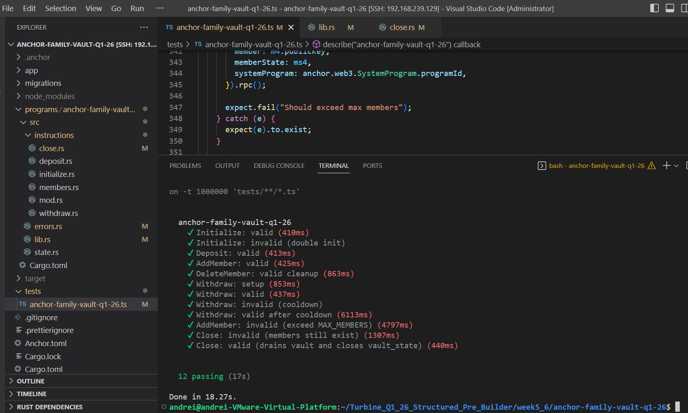
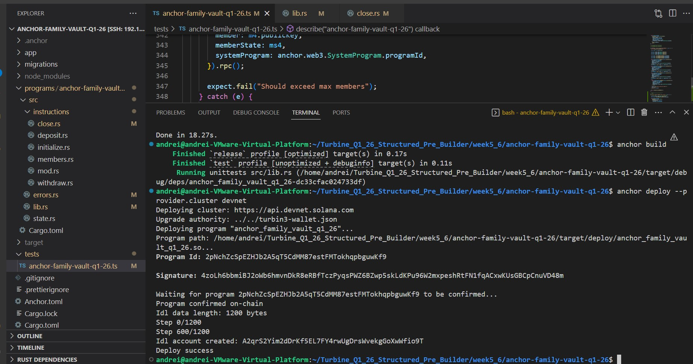

### Family Vault 🏦 

Built as a Capstone for Turbine Pre-Builders (Q1).

Family Vault is a Solana program built with Anchor that allows multiple members to manage shared funds on-chain.

The current version supports native SOL only.
Members can deposit and withdraw funds based on predefined roles and withdrawal limits.

Support for SPL tokens is planned in a future version.

### Architecture (High-Level Flow)

``` initialize ``` — creates the vault and state PDAs and sets the initial vault authority.

``` deposit ``` — transfers SOL from any user to the vault account.

``` members ``` — manages member PDAs (add, freeze, delete, set withdrawal limits) used to validate withdrawals.

``` withdraw ``` — transfers SOL from the vault to an authorized member, enforcing role permissions and withdrawal limits.

``` close ``` — closes the vault and state PDAs, deletes member PDAs, and transfers remaining lamports to the vault authority.

### Local Test Results

All instruction paths tested locally.

## Local Test Result Screenshot:



### Devnet Deployment
Program ID 
2pNchZcSpEZHJb2A5qT5CdMM87estFMTokhqpbguwKf9

Explorer Link
https://explorer.solana.com/address/2pNchZcSpEZHJb2A5qT5CdMM87estFMTokhqpbguwKf9?cluster=devnet

Deploy Transaction
https://explorer.solana.com/tx/4zoLh6bbmiBJ2oWb6hmvnDkR8eRBfTczPyqsPWZ6BZwp5skLdKPu96W2mxpeshRtFN1fqACxwKUsGBCpCnuVD48m?cluster=devnet

Deploy Screenshot:


Devnet Smoke Test

The following transaction demonstrates:
initialize (if needed)
deposit
add_member (authority as member)
withdraw

Smoke Test Transaction
2T9fE4LhArepLrKUfFSDRrcKqHkWjSr5Xk8DoN4NM3djQRwckPKeNuAnLCFhuVxEjby8tNMocpuQd5RLLWu3GbxQ

Explorer Link
https://explorer.solana.com/tx/2T9fE4LhArepLrKUfFSDRrcKqHkWjSr5Xk8DoN4NM3djQRwckPKeNuAnLCFhuVxEjby8tNMocpuQd5RLLWu3GbxQ?cluster=devnet


### Family Vault — Functional Overview

Family Vault is a role-controlled SOL vault built on Solana using Anchor.

It allows a vault authority to manage family members with controlled withdrawal permissions and enforced security rules.

## Core Functionality

# Vault Initialization

Creates a VaultState PDA and a Vault PDA.

Sets the vault authority and configuration parameters.

# Deposit

Any signer can deposit SOL into the vault.

Funds are stored in a PDA-controlled SystemAccount.

# Member Management

Add a new member (creates MemberState PDA).

Freeze / unfreeze a member.

Delete a member (must be frozen).

Enforces a maximum number of members.

# Withdraw

Only registered members can withdraw.

Withdrawals are:

Limited by a per-withdraw cap.

Restricted by cooldown period.

Blocked if member is frozen.

Blocked if vault is locked.

# Close Vault

Allowed only when no members remain.

Drains remaining SOL to authority.

Closes VaultState safely.
